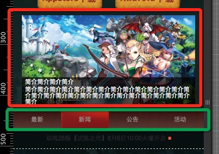
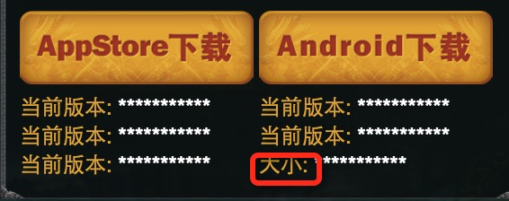
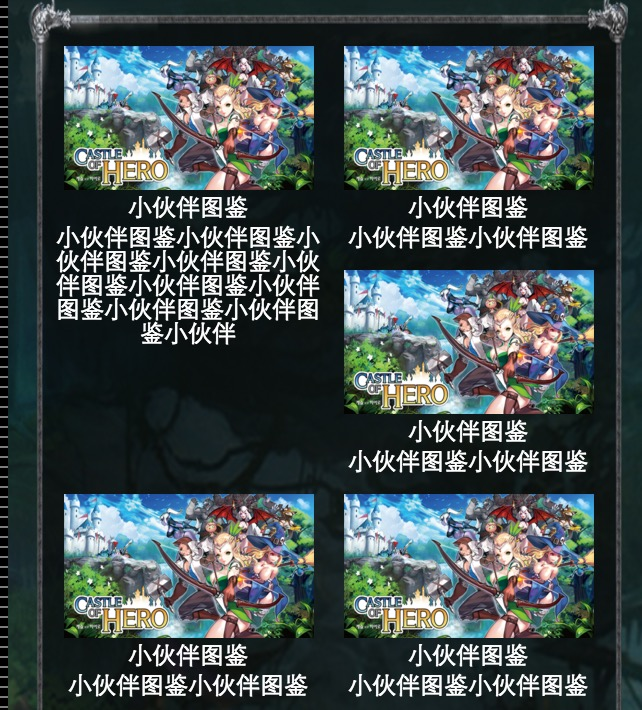

# 一. 首页 index.html
 

1. 红色部分为图片轮播，可以轮播的哦，可以用@郝浩之前用的swipe.js；
2. 红色部分里的简介，第一行文字要改的较大，可用14px与12px试一下；
3. 绿色的部分为tab切换；
4. 绿色部分下边的一行文字应该为红色，现在显示为灰色；

# 二. 所有页面
1. 背景图加载有延迟；
2. 内容框都不可延伸，内容很少或很多时都会变形，请做成可延伸的，此处也可参考PC版的做法；

# 三. 下载页 download.html

1. 红框处，若变成两个字时没有跟四个字的长度对齐，请参考psd；

# 四. 小伙伴图鉴 game_role.html

1. 当说明文字变多时就把第三个挤到右边去了，此处可参考PC版game_img.html；
2. 说明文字title字号比内容大，可用14px与12px试一下；
